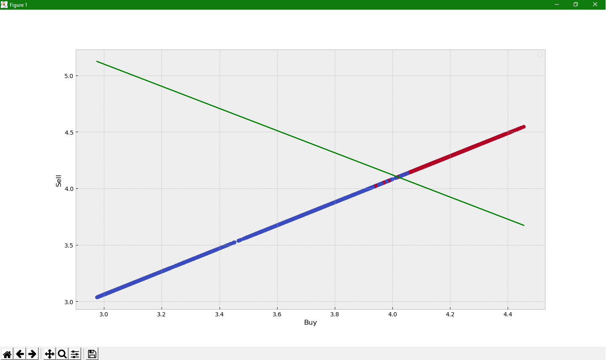

# First_contact_with_svm
First step with sklearn library and Support Vector Machine

# How to run??

1. Use git clone or download manually.

2. install all frameworks and librares from requirements.txt

   > pip3 install -r requirements.txt

   or

   > pip install -r requirements.txt

   if you set pip3 like default option

3. Run Download_Currency_values.py

